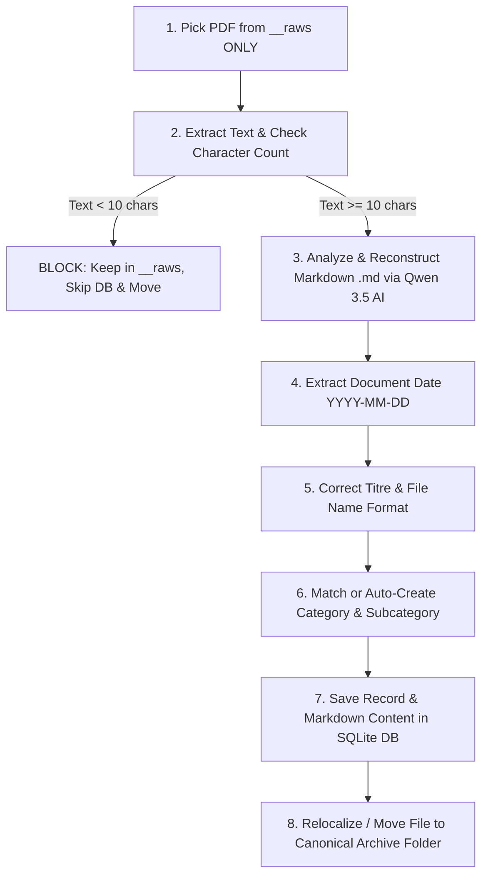

# 📜 Master System Directives & User Requirements

> **Authoritative Specification Document**  
> *This document contains all user requests, architectural rules, workflow logic, and implementation constraints for the PDF Triage & Agentic Registry system. Any AI agent working on this codebase must strictly adhere to these rules.*

---

## 0. 🧠 Golden Rule: Think First Before Action

> ⚠️ **MANDATORY THINKING & PLANNING**:
> - **Analyze First**: Always thoroughly inspect the codebase, trace imports, check SQLite database schemas, and understand existing system contracts BEFORE making changes.
> - **No Blind Assumptions**: Never guess variable names, file paths, parameters, or schema structures. Read the authoritative source code first.
> - **Evaluate Consequences**: Evaluate architectural implications and edge cases before executing code edits or commands.

---

## 1. ⚙️ Operating Environment & Execution Rules

- **Project Root**: `D:\DaiHung\__projet\__master\pdf_triage`
- **Input Directory (`__raws`)**: `C:\Users\daihu\OneDrive\GiayTo\Hung\__raws`
- **Output Archive Directory (`__archive`)**: `C:\Users\daihu\OneDrive\GiayTo\Hung\__archive`
- 🚫 **STRICT NO FULL-DISK SCAN RULE**:
  - The application and agent MUST scan **ONLY INSIDE `__raws`** (`CONFIG.INPUT_DIR`).
  - **NEVER** perform full-disk scans, parent folder searches, or directory walks outside `__raws`.
- **Server Execution Rule**:  
  ⚠️ **NEVER automatically launch background server tasks or run `npm run dev`**. Always ask/instruct the user to run or rerun `npm run dev` in their terminal on their PC.
- **10-Second Auto-Scan Watcher**:
  - The backend server automatically checks `__raws` (`CONFIG.INPUT_DIR`) **every 10 seconds**.
  - When new PDFs are detected, the server automatically runs triage scan in the background, processes files, and broadcasts SSE events so the Web UI updates category & subcategory pill counters and document cards live!

---

## 2. 🤖 Ollama Local LLM Specification

- **Active Model**: `qwen3.5:9b` (Host: `http://127.0.0.1:11434`).
- **Resilience**: Auto-spawn `ollama serve` on Windows if disconnected via `POST /api/ollama/start`.
- **Status Badge**: UI header displays real-time connection status with `▶️ Start Ollama` button.
- **Model Cleanup**: Only `qwen3.5:9b` should be used. Unused legacy models (`qwen2.5:7b`, `deepseek-r1:8b`, etc.) have been purged.

---

## 3. 🔄 Complete Triage & Processing Pipeline Workflow

When **Scan PDFs** or **10s Auto-Watcher** is triggered, process each incoming PDF using the following strict sequential flow:

### Pipeline Details:
1. **Pick PDF**: Scan strictly ONLY inside `__raws` (`CONFIG.INPUT_DIR`). NEVER scan `__archive` or parent directories during triage.
2. **Non-Blocking 1-by-1 Sequential Processing**:
   - Process PDF files sequentially **one by one**.
   - Yield to the Node.js event loop between files (`await new Promise(r => setTimeout(r, 50))`) to ensure the Web server, SSE streams, and UI stay responsive without freezing/blocking!
3. **Strict No-Text Blocking Guard**:
   - If a PDF produces **no text or fewer than 10 readable characters**, **BLOCK IT IMMEDIATELY**!
   - Log warning: `BLOCKED: No text extracted from PDF`.
   - Emit SSE event: `FILE_FAILED` with message `❌ Blocked: No text extracted from PDF. Kept in __raws.`
   - 🚫 **Do NOT save to SQLite DB!**
   - 🚫 **Do NOT move file to `__archive`! Keep it safe inside `__raws`!**
4. **Markdown Document Representation (.md)**:
   - Qwen 3.5 AI reconstructs and formats the extracted raw text into a clean, structured **Markdown (`.md`)** representation matching the visual hierarchy and layout of the original document.
   - Uses Markdown headers (`#`, `##`, `###`), tables, and key-value bullet lists.
   - Saved as `markdown_content` in SQLite DB & rendered on Web UI cards in a dedicated `📝 Document Markdown (.md)` container.
5. **No Generic `other`/`divers` Category**:
   - Generic fallback categories (`other`/`divers`) are completely PROHIBITED.
   - If a document's subject does not match an existing category, **auto-create a NEW specific category dynamically** (e.g. `education`, `recruitment`, `correspondence`, `housing`) and save to `categories.json`.
6. **Nested Subcategory Hierarchy (Sub on Sub)**:
   - Supports multi-level nested subcategories on disk & UI:
     `__archive / <category> / <sub_1> / <sub_2> / <YYYY> / <filename>.pdf`
     e.g., `__archive / education / nextech / bachelor / 2026 / document.pdf`.
7. **Canonical Path Structure**:
   - **With Subcategory**: `__archive / <category> / <subcategory> / <YYYY> / <filename>.pdf`
   - **Without Subcategory**: `__archive / <category> / <YYYY> / <filename>.pdf`
8. **File Move & DB Save**: Insert record into SQLite DB (`documents` table) and move file to canonical folder.

---

## 4. 🔧 Repair Registry & Re-Picking Flow

When **Repair Registry** is executed:
- **Missing Content Re-pick**: Any file in `__archive` with missing or unreadable text is **automatically moved back to `__raws`** (`CONFIG.INPUT_DIR`), purged from SQLite DB, and parent folders cleaned up so it can be cleanly re-picked by the next scan.
- **Ghost Record Audit**: Automatically purges stale database records whose physical files no longer exist on disk.
- **Relocalization**: Files in legacy/bad paths are automatically moved to canonical nested subcategory paths.

---

## 5. 💻 Web UI Requirements & Features

- **Windows Location Buttons**:
  - Header buttons: `📂 __raws` and `📂 __archive` (opens Windows Explorer via `POST /api/open-location`).
  - Card button: `📂 Location` (opens target PDF file).
  - Card button: `📍 Relocalize` (re-calculates canonical subcategory path and moves file).
- **Dynamic Counters & Zero-Item Disabling**:
  - Category and subcategory pills display live document counters from SQLite DB (e.g., `Factures (12)`, `SFR (5)`).
  - Items with `0` documents are disabled (`opacity: 0.35`, non-clickable).
- **Live Real-Time Auto-Update System**:
  - Whenever ANY operation occurs on backend or frontend (scan, relocalization, edit, repair, clear, auto-scan watcher tick), broadcast live SSE events (`REGISTRY_UPDATED`, `FILE_COMPLETED`, `SCAN_COMPLETED`, `CATEGORIES_UPDATED`). All connected browser tabs auto-refresh categories, subcategories, counters, and document cards **live in real-time**!
- **Markdown (.md) Document Card Display**: Each document card renders a scrollable `📝 Document Markdown (.md)` box displaying the structured Markdown representation.
- **Subcategories Manager**: Settings modal provides full subcategory CRUD (`ID`, `Name`, `Aliases`, `+ Add Sub`).
- **Toast Notifications**: Replaced browser `alert()` with non-blocking glassmorphic Toast notifications (`Toast.success`, `Toast.info`, `Toast.warning`, `Toast.error`).

---

## 6. 📊 Logging & Debugging System

- **Terminal Output**: Color-coded module logs (`[PDF_PARSER]`, `[OLLAMA_AI]`, `[RELOCALIZE]`, `[TRIAGE]`, `[SERVER]`).
- **File Logging**: Persistent ISO timestamp logs written to `D:\DaiHung\__projet\__master\pdf_triage\logs\triage_debug.log`.
