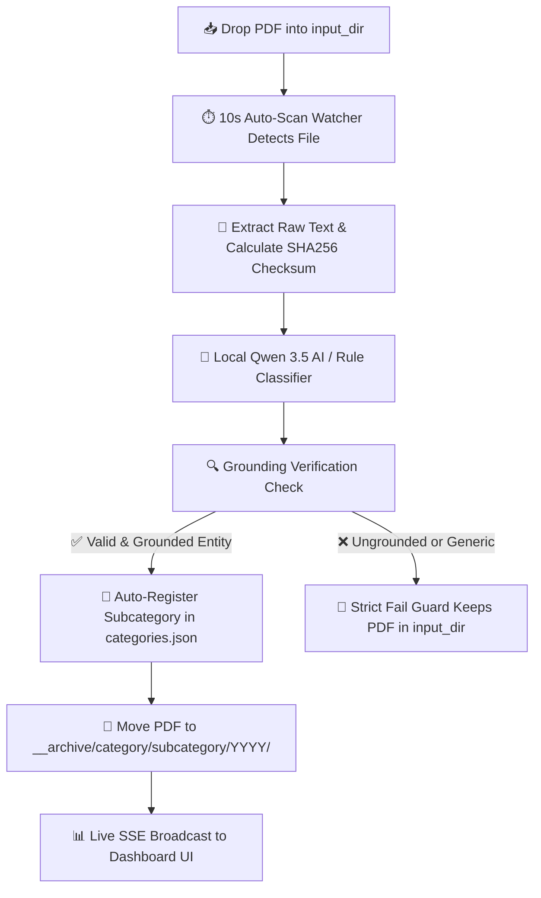

# 📁 Smart PDF Triage Dashboard

> **AI-Powered PDF Classification, Entity Extraction & Folder Sorting System**

An intelligent, privacy-first PDF classification, entity extraction, and automated document sorting system powered by local AI (**Qwen 3.5 via Ollama**).

---

## ⚙️ How the Application Mechanism Works



### 1. Automated Background Monitoring
The backend runs a **10-second non-blocking auto-scan watcher** monitoring your `input_dir` (e.g. `./input` or `__raws`). Any new PDF dropped into the input folder is detected automatically.

### 2. Deep Text Extraction & Hash Check
Each PDF is processed to extract raw text, calculate an immutable SHA-256 checksum (preventing duplicate processing), and structure document metadata.

### 3. Local Qwen 3.5 LLM Triage
The document text is passed to local **Qwen 3.5:9b via Ollama** to analyze context, determine the canonical Category, identify the specific Subcategory (issuer, company, client, or vendor name), and extract key metadata (title, date, summary, payment status).

### 4. Dynamic Auto-Registration & Fail Guard
- **Pre-Move Auto-Creation**: If a new valid subcategory slug is detected and verified, it is dynamically registered in `categories.json` BEFORE moving the file.
- **Strict Fail Guard**: If a document fails to resolve to a grounded, specific subcategory (e.g. receives `general` or ungrounded gibberish), it is **BLOCKED** and safely kept in `input_dir` for human review — preventing generic folder clutter.

### 5. Physical Folder Filing & Real-Time Sync
Accepted PDFs are moved to canonical folder paths on disk:
$$\text{output\_root\_dir} / \text{category} / \text{subcategory} / \text{YYYY} / \text{filename.pdf}$$
The SQLite FTS5 database and `registry.json` are updated in real-time, broadcasting live Server-Sent Events (SSE) to your browser dashboard.

---

## 📥 How to Input Documents for Triage

### Method A: Drop Files into Input Folder (Automatic)
1. Copy or drop any PDF files (or nested subfolders containing PDFs) into your configured input directory (e.g. `./input` or `__raws`).
2. The background watcher detects them within 10 seconds, parses their text, classifies them, and moves them to `./organized` (`__archive`).

### Method B: Manual Scan Trigger from Dashboard
1. Open the Web Dashboard at `http://localhost:3000`.
2. Click **⚡ Scan & Triage PDFs** in the top navigation bar to trigger an instant triage scan across all unindexed files in your input directory.

---

## 📊 How to Open & Use the Web Dashboard

### 1. Launch the Server
Ensure Ollama is running, then start the web server in your terminal:
```bash
npm run dev
```

### 2. Open the Dashboard in Browser
Navigate to **`http://localhost:3000`** in Google Chrome, Microsoft Edge, Firefox, or Safari.

### 3. Interactive Dashboard Features

- 📂 **Category & Subcategory Pills**: Click any category pill (e.g. `Factures Clients`, `Bulletin de Salaire`, `Identity`) or subcategory pill to instantly filter your document grid.
- 🔍 **Instant Full-Text Search (FTS5)**: Type keywords, reference numbers, or text content into the search bar to search across titles, summaries, tags, and raw PDF text in milliseconds.
- 📍 **📍 Relocalize & AI Feedback Button**:
  - Click **📍 Relocalize** on any document card to open the interactive modal.
  - Re-assign the category/subcategory, rename/edit subcategories, or select structured error reasons (*"Wrong Employer Name"*, *"Tax misclassified as Invoice"*) to teach and refine the local AI classifier.
- 📂 **Open Physical Explorer Folder**: Click **📂 Open Folder** on any document card to open Windows Explorer / OS File Manager directly at the exact PDF path on your computer.
- 🔧 **System Tools**:
  - **⚡ Scan & Triage PDFs**: Run immediate scan.
  - **🔧 Repair Registry**: Re-verify archive files and sync database.
  - **🗑️ Clear Registry**: Reset document records and return archive PDFs to input directory.
  - **⚙️ System Config**: Adjust input/output paths, Ollama model hosts, and manage categories/subcategories.

---

## 🌟 Key Features

- 🧠 **100% Local AI Classification**: Runs locally using Ollama (`qwen3.5:9b`). Zero document data sent to external cloud APIs.
- 🏢 **Multi-Tenant & Generic Architecture**: Built for Individuals, Families, Freelancers, SMBs, and Enterprise Corporations. Zero hardcoded personal names.
- 🧾 **Dual Invoice Triage**: Automatically distinguishes between **Client Sales Invoices** (`factures_clients`) and **Supplier Purchase Invoices** (`invoices`).
- 💳 **Payment Status Tracking**: Automatically extracts payment signals and tags invoices as `PAID` or `UNPAID / PENDING`.
- 🪪 **Identity & Legal Document Sorting**: Intelligent routing for Residence Permits (`titre_sejour`), Passports, CNI, Tax Notices, and Pay Slips (`bulletin_salaire`).
- 🛡️ **Strict Fail Guard**: Blocks ungrounded or generic folder creation, keeping unclassified files safely in `input_dir` for review.

---

## 🛠️ Technology Stack

- **Core Engine**: TypeScript, Node.js, Express
- **AI / LLM**: Ollama (`qwen3.5:9b`), Local Embeddings (`nomic-embed-text`)
- **Database**: SQLite3 with FTS5 Full-Text Search
- **PDF Extraction**: `pdf-parse` / PDF.js
- **Testing & Build**: Vitest, ESBuild, TypeScript Compiler (`tsc`)

---

## 🚀 Quick Start

### 1. Prerequisites
- **Node.js** v20+ installed.
- **Ollama** installed locally ([ollama.com](https://ollama.com)).
- Pull model:
  ```bash
  ollama pull qwen3.5:9b
  ```

### 2. Installation & Run
```bash
git clone https://github.com/<your-username>/smart-pdf-triage.git
cd smart-pdf-triage
npm install
cp settings.json.example settings.json

# Web Server Mode:
npm run dev

# Desktop App Mode (Taskbar Tray & Auto Browser Launch):
npm run desktop
```

---

## 🧪 Testing & Code Quality

```bash
# Run all 88 unit tests
npm test

# Run TypeScript type check
npx tsc --noEmit
```

---

## 📄 License

MIT License. Free for personal, commercial, and enterprise use.
